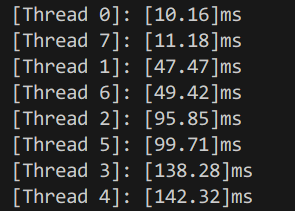
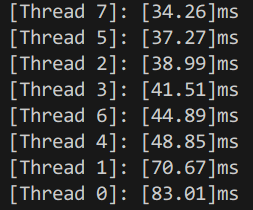

# Assignment 1: Performance Analysis on a Quad-Core CPU #

原始题目见 [Handout.md](./Handout.md)

## Program 1: Parallel Fractal Generation Using Threads

> Modify the starter code to parallelize the Mandelbrot generation using two processors. Specifically, compute the top half of the image in thread 0, and the bottom half of the image in thread 1. This type of problem decomposition is referred to as spatial decomposition since different spatial regions of the image are computed by different processors.

详见代码

> Extend your code to use 2, 3, 4, 5, 6, 7, and 8 threads, partitioning the image generation work accordingly (threads should get blocks of the image). Note that the processor only has four cores but each core supports two hyper-threads, so it can execute a total of eight threads interleaved on its execution contents. In your write-up, produce a graph of speedup compared to the reference sequential implementation as a function of the number of threads used FOR VIEW 1. Is speedup linear in the number of threads used? In your writeup hypothesize why this is (or is not) the case? (you may also wish to produce a graph for VIEW 2 to help you come up with a good answer. Hint: take a careful look at the three-thread datapoint.)

|num of thread|speed up (view 1)|speed up (view 2)|
|-|-|-|
|1|1x|1x|
|2|1.87x|1.58x|
|3|1.63x|2.13x|
|4|2.41x|2.29x|
|5|2.31x|2.62x|
|6|3.04x|3.07x|
|7|3.11x|3.31x|
|8|3.71x|3.85x|

根据该表格，加速比和使用的线程数并不是线性关系。

> To confirm (or disprove) your hypothesis, measure the amount of time each thread requires to complete its work by inserting timing code at the beginning and end of workerThreadStart(). How do your measurements explain the speedup graph you previously created?

事实上，由于每个线程分配的计算量不均，会导致加速比波动。
在按照行均分为八个线程时，每个线程运算时间为

中间区域（Thread 3, 4）的计算量显然要大于两侧区域（Thread 0, 7）

这导致某些时刻，线程数增加反而导致加速比下降（2 to 3）

同时，在 VIEW 2 下线程数和加速比更接近线性关系，
这是由于 VIEW 2 下均分行分配给线程的计算量相近。

7-/

> Modify the mapping of work to threads to achieve to improve speedup to at about 7-8x on both views of the Mandelbrot set (if you're above 7x that's fine, don't sweat it). You may not use any synchronization between threads in your solution. We are expecting you to come up with a single work decomposition policy that will work well for all thread counts---hard coding a solution specific to each configuration is not allowed! (Hint: There is a very simple static assignment that will achieve this goal, and no communication/synchronization among threads is necessary.). In your writeup, describe your approach to parallelization and report the final 8-thread speedup obtained.

观察计算密度分布，再进行行的分配，让每个进程的计算量趋于相等。
关于行和计算量的关系可以静态分析，或者用插值实现

TODO

> Now run your improved code with 16 threads. Is performance noticably greater than when running with eight threads? Why or why not?

当不同线程的任务量已经趋于相等时，超过物理线程的线程数会增加非并行部分的花费，

但在并行性不够好时，增加线程超过物理线程数相当于手动将任务分成更小的部分，从而提高加速比。

## Program 2: Vectorizing Code Using SIMD Intrinsics

> Implement a vectorized version of clampedExpSerial in clampedExpVector . Your implementation should work with any combination of input array size (N) and vector width (VECTOR_WIDTH).

详见代码

> Run ./myexp -s 10000 and sweep the vector width from 2, 4, 8, to 16. Record the resulting vector utilization. You can do this by changing the #define VECTOR_WIDTH value in CS149intrin.h. Does the vector utilization increase, decrease or stay the same as VECTOR_WIDTH changes? Why?

|vector width|utilization|
|-|-|-|
|2|79.8%|
|4|72.1%|
|8|68.1%|
|16|66.3%|

随着 VECTOR_WIDTH 提升，vector utilization 不断下降-
详见代码

## Program 3: Parallel Fractal Generation Using ISPC

> Compile and run the program mandelbrot ispc. The ISPC compiler is currently configured to emit 8-wide AVX2 vector instructions. What is the maximum speedup you expect given what you know about these CPUs? Why might the number you observe be less than this ideal? (Hint: Consider the characteristics of the computation you are performing? Describe the parts of the image that present challenges for SIMD execution? Comparing the performance of rendering the different views of the Mandelbrot set may help confirm your hypothesis.).

最大理论加速比应该在 8x 左右

实际上 VIEW 1 的加速比在 4.57x，VIEW 2 的加速比在 3.98x

由于白色节点的的迭代次数较多，黑色节点的迭代次数较少，
当向量同时包含了黑白节点，其并行度就会降低。
而在 VIEW 2 中黑白节点的「混合」更多，导致了其加速比更低。

> Run mandelbrot_ispc with the parameter --tasks. What speedup do you observe on view 1? What is the speedup over the version of mandelbrot_ispc that does not partition that computation into tasks?

||origin|ISPC|task ISPC|
|-|-|-|-|
|speed up (view 1)|1.00x|4.47x|8.87x|
|speed up (view 2)|1.00x|3.83x|6.88x|

* SIMD instructions executed on a single core.
* Task executed in parallel on different CPU cores

> There is a simple way to improve the performance of mandelbrot_ispc --tasks by changing the number of tasks the code creates. By only changing code in the function mandelbrot_ispc_withtasks(), you should be able to achieve performance that exceeds the sequential version of the code by over 32 times! How did you determine how many tasks to create? Why does the number you chose work best?

当 task 数在 800 时，加速效果，几乎是串行效率的 28 倍

如 ISPC 文档所说：

> In general, one should launch many more tasks than there are processors in the system to ensure good load-balancing, but not so many that the overhead of scheduling and running tasks dominates the computation.

提高 task 数能提高并行的效率。

> Extra Credit: (2 points) What are differences between the thread abstraction (used in Program 1) and the ISPC task abstraction? There are some obvious differences in semantics between the (create/join and (launch/sync) mechanisms, but the implications of these differences are more subtle. Here's a thought experiment to guide your answer: what happens when you launch 10,000 ISPC tasks? What happens when you launch 10,000 threads? (For this thought experiment, please discuss in the general case

不会，感觉 task 和 thread 差不多，
但 task 对应的是 SIMD instruction

> The smart-thinking student's question: Hey wait! Why are there two different mechanisms (foreach and launch) for expressing independent, parallelizable work to the ISPC system? Couldn't the system just partition the many iterations of foreach across all cores and also emit the appropriate SIMD code for the cores?

因为 task 和 foreach 面向的任务不同

* foreach：控制流几乎相同
* task：控制流可以完全不同

